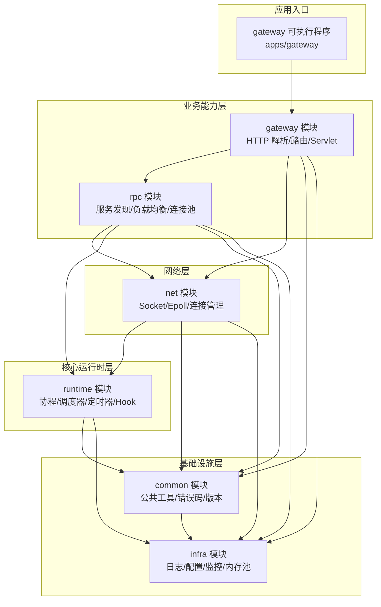
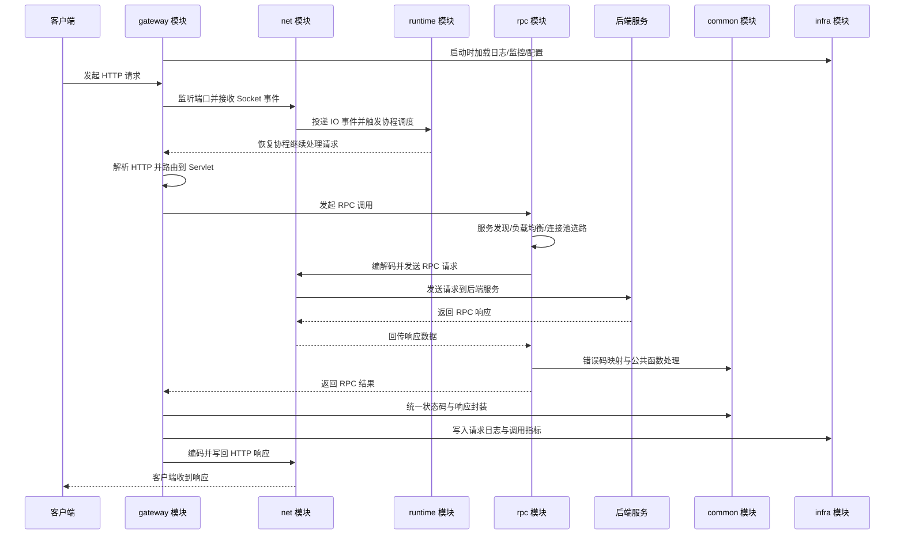

# 开发指南

## 1. 文档信息
- 项目名称：基于协程库的高性能分布式 RPC 网关
- 文档名称：开发指南
- 开发周期：2025-07-01 至 2025-10-31（18 周）
- 开发模式：独立开发
- 技术栈：C++17、Epoll、Socket、Protobuf、pthread、ucontext、ZooKeeper、spdlog

## 2. 项目概述

### 2.1 项目目标
从零构建高性能分布式 RPC 框架，集成自研 Web API 网关与 Krpc RPC 客户端，核心能力如下：
1. 实现轻量协程运行时（非对称协程）
2. 实现 M:N 协程调度器与 IO 事件调度
3. 通过 Hook 将阻塞系统调用异步化
4. 构建 Reactor 模型 HTTP 网关并完成 RPC 转发
5. 实现服务发现、负载均衡、连接池、本地缓存
6. 实现异步日志与高效内存池
7. 实现稳定性治理：超时分层、重试预算、熔断、限流、降级
8. 实现全链路追踪：TraceId 贯穿 gateway -> rpc -> backend
9. 实现背压与过载保护：请求队列上限、连接池上限、快速失败
10. 实现性能优化：Protobuf、批量发送、零拷贝缓冲
11. 实现配置治理：动态配置热更新、灰度发布、回滚
12. 实现安全增强：TLS/mTLS、鉴权、请求大小与频率限制
13. 实现依赖收敛：跨层依赖最小化与接口抽象

### 2.2 量化指标
- QPS 提升：43 倍（相较初始版本）
- 平均延迟：294ms 降至 2.67ms
- 稳定性：支持长连接与高并发持续压测
- 可观测性：TraceId 覆盖率 100%，支持 p95/p99 与错误率看板
- 稳定性治理：重试预算命中可控，无无限重试与级联放大
- 配置治理：关键配置支持热更新，灰度/回滚可在分钟级完成

### 2.3 范围边界
- 本期包含：协程框架、网关、RPC 客户端、日志、内存池、压测优化
- 本期不包含：跨机房容灾、多协议网关、控制面编排系统

## 3. 总体架构

### 3.1 分层架构
1. Runtime：Coroutine / Scheduler / Timer / Hook
2. Network：Socket / Epoll / Connection / Codec
3. RPC：KrpcChannel / Registry / LoadBalancer / ConnPool
4. Gateway：HTTP Parser / Router / Servlet / Proxy
5. Infra：Logger / Config / Metrics / MemoryPool

### 3.2 请求流转路径
1. 客户端发起 HTTP 请求到网关
2. Reactor 线程完成 `accept/read/parse`
3. Router 定位 Servlet，组装 RPC 请求
4. KrpcChannel 查本地缓存并选择服务节点
5. 连接池复用或新建连接
6. Hook + 协程完成 `send/recv`，超时由定时器托管
7. RPC 响应解析并转为 HTTP 响应
8. 异步日志记录请求链路与关键指标

### 3.3 系统架构图

### 3.4 请求时序流程图（以此顺序执行）

## 4. 核心模块实现指南

### 4.1 非对称协程（ucontext）

#### 4.1.1 状态定义
- `READY`：可调度
- `RUNNING`：执行中
- `TERM`：执行完成或终止

#### 4.1.2 核心结构
- `Coroutine`：`id/state/stack/context/callback`
- `Scheduler`：`main_coroutine/current_coroutine/run_queue`

#### 4.1.3 关键实现
1. 使用 `getcontext/makecontext/swapcontext` 初始化协程入口
2. 主协程与子协程通过 `resume/yield` 切换
3. 协程结束后统一进入 `TERM`，由回收逻辑释放资源

#### 4.1.4 注意事项
- 协程栈大小需可配置（建议 64KB~256KB）
- 禁止协程函数深递归
- 退出前需解除 fd、timer 绑定，避免悬挂回调

### 4.2 M:N 协程调度器

#### 4.2.1 目标
在 N 个线程中调度 M 个协程，提升吞吐并降低线程上下文开销。

#### 4.2.2 设计点
1. 任务队列：全局队列 + 可选本地队列
2. 空闲策略：Idle 协程处理空转与唤醒
3. 并发安全：原子变量统计任务量 + 互斥锁保护关键区
4. 生命周期：`start -> run -> stop -> join`

#### 4.2.3 调度流程
1. Worker 线程拉取 READY 协程
2. 协程执行至主动让出或阻塞点
3. 阻塞点通过 Hook 交给 IOManager
4. 事件就绪后协程重回 READY 队列

### 4.3 IO 协程调度（Epoll + Timer）

#### 4.3.1 目标
将 fd 事件、超时事件统一纳入事件循环，实现非阻塞调度。

#### 4.3.2 关键结构
- `FdContext`：读写事件回调、协程句柄、超时句柄
- `IOManager`：`epoll_fd/pending_events/timer_manager`
- `TimerManager`：最小堆管理定时任务

#### 4.3.3 实现流程
1. 读写操作前设置 fd 非阻塞
2. 注册 `EPOLLIN/EPOLLOUT` 事件并挂起当前协程
3. `epoll_wait` 返回后触发回调，恢复协程
4. 超时由定时器触发取消，返回超时错误码

#### 4.3.4 异常处理
- `EINTR`：重试
- `EAGAIN`：继续等待事件
- `EPOLLERR/EPOLLHUP`：清理上下文并关闭连接

### 4.4 Hook 机制（阻塞转异步）

#### 4.4.1 Hook 范围
- `sleep`
- `connect`
- `accept`
- `read/write`
- `recv/send`

#### 4.4.2 机制说明
1. 启用 Hook 后，调用阻塞函数先尝试系统调用
2. 若返回可重试（如 `EAGAIN`），则注册 IO 事件并挂起协程
3. 事件触发后恢复协程继续执行
4. 对 `connect` 增加超时定时器，超时后主动取消并返回错误

#### 4.4.3 实现建议
- 通过 `dlsym(RTLD_NEXT, ...)` 获取原始系统调用
- 线程局部变量控制 Hook 开关，避免影响非协程线程
- 保持 errno 语义与原生行为一致

### 4.5 HTTP 网关（Reactor + Servlet）

#### 4.5.1 功能目标
- 支持 HTTP 长连接
- 完成路由匹配与参数解析
- 以 Servlet 模式转发 RPC 请求

#### 4.5.2 处理链路
1. `accept` 新连接 -> 连接上下文初始化
2. `read` 收包 -> HTTP parser 解析请求头与 body
3. Router 匹配 URI 到 Servlet
4. Servlet 组装 protobuf 请求并调用 KrpcChannel
5. 收到 RPC 响应后编码 HTTP 返回

#### 4.5.3 关键点
- keep-alive 复用连接，空闲超时定时回收
- header/body 长度限制，防止大包攻击
- 统一错误映射：网关错误码 -> HTTP 状态码

### 4.6 Krpc 客户端

#### 4.6.1 组件
- `ServiceDiscovery`：对接 ZooKeeper 获取服务列表
- `LoadBalancer`：RR / 随机 / 最少连接（建议实现 RR + 最少连接）
- `ConnPool`：按服务节点维护连接池
- `LocalCache`：本地缓存服务地址并定期刷新

#### 4.6.2 调用流程
1. 根据服务名查询本地缓存
2. 缓存 miss 时从 ZooKeeper 拉取并回填
3. 负载均衡选取目标节点
4. 从连接池取连接并发起 RPC
5. 失败重试（限次）与熔断计数

#### 4.6.3 可靠性策略
- 连接健康检查（心跳/读写探测）
- 节点下线快速摘除
- 请求超时 + 可配置重试（避免无限重试）

### 4.7 内存池与日志系统

#### 4.7.1 哈希槽内存池
- 64 个槽位（8B~512B，按 8B 步长）
- 小对象优先从槽分配，降低 malloc/free 频率
- 大对象回退系统分配

#### 4.7.2 异步日志（spdlog）
- 多生产者单消费者队列
- 日志分级：TRACE/DEBUG/INFO/WARN/ERROR
- 热路径仅做轻量打点，避免同步刷盘阻塞

### 4.8 稳定性治理（超时分层/重试预算/熔断/限流/降级）

#### 4.8.1 使用组件
- `GatewayDeadline`：网关入口请求 deadline
- `RpcCallPolicy`：RPC 超时、重试预算、熔断策略
- `RateLimiter`：令牌桶/漏桶限流
- `DegradeHandler`：降级返回与兜底策略

#### 4.8.2 改进内容
1. 超时分层：入口超时 -> RPC 子调用超时 -> IO 超时，统一由 deadline 传递
2. 重试预算：按窗口限制重试比例，禁止无限重试
3. 熔断：失败率触发 open，半开探测恢复
4. 限流：按路由、按调用方、按实例限流
5. 降级：熔断/过载时返回静态兜底或缓存数据

#### 4.8.3 验收标准
- 故障注入下无级联雪崩
- 超时、重试、熔断命中均有指标可观测

### 4.9 全链路追踪与指标

#### 4.9.1 使用组件
- `TraceContext`：`trace_id/span_id` 上下文
- `MetricsRegistry`：请求总量、错误率、延迟分位数
- 日志 MDC：日志自动携带 `trace_id`

#### 4.9.2 改进内容
1. gateway 生成或透传 TraceId，写入请求上下文
2. rpc 模块在协议头透传 TraceId 至后端
3. 指标按路由/服务维度上报 p50/p95/p99 与错误率

#### 4.9.3 验收标准
- 核心链路 TraceId 覆盖率 100%
- 可按 TraceId 关联网关日志与 RPC 调用日志

### 4.10 背压与过载保护

#### 4.10.1 使用组件
- `BoundedQueue`：有界请求队列
- `ConnPool`：连接池上限与排队策略
- `FastFail`：快速失败（429/503）

#### 4.10.2 改进内容
1. 入口请求队列设置上限，超限直接快速失败
2. 连接池设置最大连接与最大等待时长
3. 当 CPU/队列水位超阈值时主动降载

#### 4.10.3 验收标准
- 峰值流量下系统可退化但不雪崩
- 过载阶段 p99 抖动可控

### 4.11 性能优化（协议与传输）

#### 4.11.1 使用组件
- `Protobuf`：IDL 与编解码
- `BatchSender`：批量发送聚合
- `IOBuffer`：零拷贝/少拷贝缓冲管理

#### 4.11.2 改进内容
1. protobuf schema 收敛字段与编码大小
2. 高频小包场景引入批量发送
3. 减少内存拷贝与临时对象分配

#### 4.11.3 验收标准
- 相同负载下 CPU 与网络开销下降
- 吞吐提升且 p99 不回退

### 4.12 配置治理（热更新/灰度/回滚）

#### 4.12.1 使用组件
- `ConfigCenterClient`：配置拉取与订阅
- `ConfigSnapshot`：本地快照与版本管理
- `GrayReleaseRule`：灰度规则与回滚按钮

#### 4.12.2 改进内容
1. 限流阈值、超时、熔断参数支持热更新
2. 配置变更支持按实例/比例灰度
3. 失败时可一键回滚到上一个稳定版本

#### 4.12.3 验收标准
- 热更新不重启服务
- 回滚流程演练可在分钟级完成

### 4.13 安全基线（TLS/mTLS/鉴权）

#### 4.13.1 使用组件
- TLS/mTLS 证书体系
- `AuthInterceptor`：Token/API Key/JWT 校验
- `RequestGuard`：请求体大小与频率限制

#### 4.13.2 改进内容
1. 网关到后端默认 TLS，核心服务支持 mTLS
2. 统一鉴权拦截器与路由级权限配置
3. 限制请求体大小、Header 大小与请求频率

#### 4.13.3 验收标准
- 未授权请求被拦截并审计
- 安全策略命中有日志与指标

### 4.14 依赖收敛与接口抽象

#### 4.14.1 使用组件
- `IRpcClient`、`IServiceDiscovery`、`ILoadBalancer` 等接口
- 模块边界检查脚本（include 依赖与命名空间约束）

#### 4.14.2 改进内容
1. gateway 仅依赖 rpc 抽象接口，不直接触达 net/runtime 细节
2. rpc 对 discovery/lb/pool 采用接口注入，支持替换与测试
3. 统一错误码与异常语义，减少跨层分支耦合

#### 4.14.3 验收标准
- 关键模块可通过 mock 做单测
- 跨层 include 与循环依赖持续下降

## 5. 开发周期计划（精确到周）

> 周任务执行顺序以“3.4 请求时序流程图”为主线推进。

> 周期：2025-07-01 至 2025-10-31（18 周）

### 5.0 改进项与周任务映射
1. 稳定性治理：W7、W11、W12、W13、W16
2. 全链路追踪：W10、W14、W15、W16
3. 背压与过载保护：W8、W13、W16
4. 性能优化：W14、W15、W16
5. 配置治理：W1、W17
6. 安全增强：W9、W17
7. 依赖收敛：W1、W9、W18

### 5.1 Phase 1：运行时与调度基础（W1-W5，2025-07-01 ~ 2025-08-04）

#### W1（07-01 ~ 07-07）
- 任务：
1. 完成项目骨架与模块目录规划
2. 定义跨层接口抽象（`IRpcClient`、`IServiceDiscovery`、`ILoadBalancer`）
3. 搭建配置中心客户端骨架与本地配置快照能力
- 验收：
1. 可编译基础工程与 CI 脚本
2. 模块依赖矩阵通过检查（无非法跨层 include）

#### W2（07-08 ~ 07-14）
- 任务：
1. 实现 `Coroutine` 与状态机
2. 完成 `resume/yield` 切换路径
3. 加入协程生命周期管理与回收
- 验收：
1. 单线程 10w 次切换稳定
2. 无内存泄漏（valgrind）

#### W3（07-15 ~ 07-21）
- 任务：
1. 实现 M:N 调度器基础版本
2. 接入任务队列与 Idle 协程
3. 实现调度停止与线程回收逻辑
- 验收：
1. 多线程压力下无死锁
2. 队列并发读写正确

#### W4（07-22 ~ 07-28）
- 任务：
1. 实现 Epoll 事件循环
2. 建立 `FdContext` 与事件回调模型
3. 打通 IO 事件触发恢复协程路径
- 验收：
1. 支持读写事件注册/回调
2. 回调与协程恢复无竞态

#### W5（07-29 ~ 08-04）
- 任务：
1. 实现最小堆定时器
2. 定时器与 IOManager 融合
3. 建立请求 deadline 上下文基础结构
- 验收：
1. 定时精度与回调顺序正确
2. IO+Timer 混合场景稳定运行

### 5.2 Phase 2：Hook 与网络网关（W6-W10，2025-08-05 ~ 2025-09-08）

#### W6（08-05 ~ 08-11）
- 任务：
1. Hook `sleep/read/write/recv/send`
2. 建立 Hook 开关（TLS）
3. 完成 errno 兼容校验
- 验收：
1. 阻塞调用可协程化
2. 与非 Hook 线程互不干扰

#### W7（08-12 ~ 08-18）
- 任务：
1. Hook `connect/accept` 并完成 connect 超时控制
2. 打通 gateway -> rpc -> net 的超时分层传递
3. 实现重试预算基础模块（时间窗口 + 预算阈值）
- 验收：
1. 上游 deadline 小于下游超时配置时按剩余预算生效
2. 压测下无无限重试

#### W8（08-19 ~ 08-25）
- 任务：
1. 实现 HTTP parser 与 Reactor accept/read/write 主循环
2. 增加 Header/Body 大小限制
3. 引入入口有界队列与超限快速失败（429/503）
- 验收：
1. 支持并发短连接/长连接
2. 峰值流量下无队列失控和内存暴涨

#### W9（08-26 ~ 09-01）
- 任务：
1. 实现 Router + Servlet 与网关错误码映射
2. 增加鉴权拦截器（API Key/JWT）
3. 网关改为仅依赖 rpc 抽象接口，去除跨层直接调用
- 验收：
1. URI 路由稳定命中，4xx/5xx 语义一致
2. 未授权请求可拦截并审计

#### W10（09-02 ~ 09-08）
- 任务：
1. Gateway 与 RPC 调用链打通
2. 实现 TraceId 生成/透传（HTTP Header -> RPC Header）
3. 上报路由维度延迟分位数与错误率
- 验收：
1. HTTP -> RPC -> HTTP 端到端可用
2. 可按 TraceId 关联网关日志与 RPC 日志

### 5.3 Phase 3：RPC 组件完善与治理增强（W11-W16，2025-09-09 ~ 2025-10-20）

#### W11（09-09 ~ 09-15）
- 任务：
1. 实现 KrpcChannel Protobuf 编解码与同步/异步接口
2. 完善请求超时与取消语义
3. 将重试预算接入 RPC 调用链
- 验收：
1. 基础 RPC 调用可用
2. 超时与重试行为可配置且可观测

#### W12（09-16 ~ 09-22）
- 任务：
1. 对接 ZooKeeper 服务发现与本地缓存刷新
2. 实现熔断器状态机（closed/open/half-open）
3. 实现降级策略（静态兜底/缓存兜底）
- 验收：
1. 节点变更可秒级生效
2. 故障注入下熔断与降级策略生效

#### W13（09-23 ~ 09-29）
- 任务：
1. 实现负载均衡（RR + 最少连接）
2. 实现连接池上限、等待超时、健康检查
3. 增加连接池等待队列上限与快速失败
- 验收：
1. 节点流量分配符合策略预期
2. 过载场景下可退化但不雪崩

#### W14（09-30 ~ 10-06）
- 任务：
1. 实现 64 槽位内存池并集成 spdlog 异步日志
2. 增加 `BatchSender` 与零拷贝缓冲路径
3. 细化追踪 span（gateway/rpc/net）
- 验收：
1. 内存与日志开销可控，无明显吞吐回退
2. 追踪可定位到具体慢阶段

#### W15（10-07 ~ 10-13）
- 任务：
1. 全链路压测与 Profiling（并发、长连接、混合负载）
2. 优化 Protobuf schema 与热点序列化路径
3. 第一轮性能优化（锁竞争、拷贝路径、系统调用次数）
- 验收：
1. QPS、p95、p99 指标阶段性达标
2. 输出性能分析报告与优化对比数据

#### W16（10-14 ~ 10-20）
- 任务：
1. 第二轮性能优化与 24h 稳定性压测
2. 进行故障演练（延迟抖动、丢包、节点上下线）
3. 收敛限流/熔断/重试参数并固化默认配置
- 验收：
1. 达成 QPS 提升 43 倍目标
2. 平均延迟约 2.67ms，错误率与 p99 保持在目标区间

### 5.4 Phase 4：发布治理与收尾（W17-W18，2025-10-21 ~ 2025-10-31）

#### W17（10-21 ~ 10-27）
- 任务：
1. 完成配置热更新、灰度发布、回滚流程
2. 接入 TLS/mTLS 与证书轮转策略
3. 输出运维手册（限流、熔断、回滚、证书故障排查）
- 验收：
1. 热更新不重启服务
2. 回滚演练可在分钟级完成

#### W18（10-28 ~ 10-31）
- 任务：
1. 完成依赖收敛与接口抽象收尾，清理跨层耦合
2. 最终发布包构建与版本基线冻结（tag）
3. 项目复盘与下一期规划
- 验收：
1. 发布产物可复现构建
2. 复盘明确后续演进路线与技术债清单

## 6. 关键功能实现细则

### 6.1 协程与 Hook 协同
1. 用户代码调用 `read()` 时先进入 Hook 层
2. Hook 检查 fd 是否就绪，不就绪则注册 epoll 事件
3. 当前协程 yield，调度器切换
4. 事件触发后恢复协程，继续调用原始 `read()`

### 6.2 connect 超时实现
1. 对 `connect` 返回 `EINPROGRESS` 的 fd 注册 `EPOLLOUT`
2. 同时添加超时 timer
3. 任一事件先到：成功写事件则取消 timer；超时则取消 fd 事件并返回超时错误

### 6.3 请求级超时控制
1. 网关入口为每个请求创建 deadline
2. 下游 RPC 调用继承剩余超时预算
3. 超时后立即中止后续重试并返回网关超时响应

### 6.4 负载均衡与本地缓存协作
1. 优先读取本地缓存节点列表，降低注册中心访问频率
2. 节点列表加版本号，监听到变更才更新
3. 节点熔断期间从可选列表剔除，恢复后再放开

## 7. 测试与验收方案

### 7.1 测试分层
- 单元测试：协程切换、定时器精度、Hook 行为、编解码
- 集成测试：网关到 RPC 端到端、服务发现变更、连接池复用
- 压力测试：QPS、P99 延迟、CPU/内存、FD 曲线
- 稳定性测试：24h 长稳、网络抖动、节点上下线
- 治理测试：超时分层、重试预算、熔断/限流/降级、背压触发
- 安全测试：TLS/mTLS、鉴权绕过、请求大小与频率限制
- 配置测试：热更新一致性、灰度发布、回滚演练

### 7.2 验收指标
- 功能：核心链路全部通过
- 性能：QPS、延迟达到目标值
- 稳定：长时间运行无崩溃/泄漏
- 可运维：日志、错误码、指标可定位问题
- 可观测：TraceId 覆盖率 100%，支持 p95/p99 与错误率观测
- 可治理：过载场景可快速失败且无级联雪崩
- 可发布：配置回滚和证书轮转流程可演练可复盘

## 8. 风险清单与应对
- 风险：协程状态错乱导致死锁
  - 应对：统一状态流转点，加入断言和调试日志
- 风险：Hook 破坏原系统调用语义
  - 应对：严格对齐 errno 与返回值语义，增加兼容测试
- 风险：连接池并发竞争
  - 应对：双重检查 + 分段锁 + 连接健康检测
- 风险：ZooKeeper 抖动导致服务列表不稳定
  - 应对：本地缓存兜底 + 退避重试 + 快照回滚
- 风险：重试与超时配置不当引发级联故障
  - 应对：强制重试预算 + 分层超时 + 熔断保护
- 风险：追踪与日志打点过重导致性能回退
  - 应对：采样率分级 + 异步落盘 + 热路径轻量字段
- 风险：热更新配置错误影响线上稳定性
  - 应对：灰度发布 + 版本快照 + 一键回滚
- 风险：跨层依赖膨胀导致改动放大
  - 应对：接口抽象 + 依赖检查脚本 + 每周架构审查

## 9. 交付物清单
1. 源码：协程框架、网关、RPC 客户端、基础设施组件
2. 文档：开发指南、架构设计、部署手册、压测报告
3. 脚本：构建脚本、压测脚本、日志切分脚本
4. 发布：版本标签、变更记录、可复现构建产物

## 10. 里程碑总结
1. M1（2025-08-04）：协程+调度+定时器完成
2. M2（2025-09-08）：Hook+网关基础链路完成
3. M3（2025-10-20）：RPC 完整能力与性能优化达标
4. M4（2025-10-31）：文档化、发布、复盘完成

